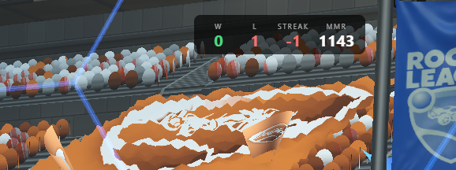

# RL Live Tracker

Overlay desktop **Electron + React** pour Rocket League qui affiche en temps réel vos stats de session (Wins, Losses, Streak, MMR) directement par-dessus le jeu.



---

## Fonctionnement

L'application se connecte à la **Stats API officielle de Rocket League** (socket TCP local sur `127.0.0.1:49123`) pour recevoir les événements de match en temps réel.

### Ce qui est affiché

| Stat | Description |
|------|-------------|
| **W** | Nombre de victoires depuis le lancement |
| **L** | Nombre de défaites depuis le lancement |
| **STREAK** | Série en cours (positive = wins, négative = losses) |
| **MMR** | MMR actuel récupéré automatiquement |

### Deux modes disponibles

- **Overlay transparent** — Fenêtre always-on-top, transparente et non-cliquable affichée directement par-dessus Rocket League (mode fenêtré / borderless requis).
- **Source OBS** — Un serveur HTTP local est lancé pour intégrer l'overlay en tant que Browser Source dans OBS.

### Raccourcis clavier

| Raccourci | Action |
|-----------|--------|
| `Ctrl+Shift+Left` | Déplacer l'overlay à gauche |
| `Ctrl+Shift+Right` | Déplacer l'overlay à droite |
| `Ctrl+Shift+H` | Afficher / masquer l'overlay |
| `Ctrl+Shift+R` | Réinitialiser les stats de session |
| `Ctrl+Shift+I` | Ouvrir l'historique des matchs |

> ⚠️ Rocket League doit tourner en mode **fenêtré** ou **borderless** pour que l'overlay soit visible par-dessus le jeu.

---

## Installation via l'exécutable (.exe)

1. Rendez-vous sur la page [**Releases**](https://github.com/aubriand/rl-live-tracker/releases) du projet.
2. Téléchargez le fichier `RL Live Tracker*.exe` de la dernière version.
3. Lancez l'exécutable — aucune installation requise (portable).
4. Démarrez Rocket League, l'overlay se connecte automatiquement.

---

## Lancement en local (développement)

### Prérequis

- [Node.js](https://nodejs.org/) v20 ou supérieur
- npm

### Étapes

```bash
# 1. Cloner le dépôt
git clone https://github.com/aubriand/rl-live-tracker.git
cd rl-live-tracker

# 2. Installer les dépendances
npm install

# 3. Lancer en mode développement (Vite + Electron)
npm run dev
```

L'application démarre avec Vite en watch mode et Electron se lance automatiquement dès que le serveur de dev est prêt.

### Générer un build de production

```bash
# Build complet + exécutable Windows portable
npm run dist:win

# macOS
npm run dist:mac

# Linux (AppImage)
npm run dist:linux
```

L'exécutable généré se trouve dans le dossier `dist-electron/`.

---

## Stack technique

- **Electron** — Main process, socket TCP, IPC
- **React 18** — Renderer ultra-léger (aucune logique métier)
- **Vite** — Build rapide
- **Zustand** — State management minimal
- **Node.js net** — Connexion event-driven à la Stats API

### Objectifs de performance

| Métrique | Cible |
|----------|-------|
| CPU | < 2 % |
| RAM | < 150 MB |
| UI refresh | max 10 fps |
